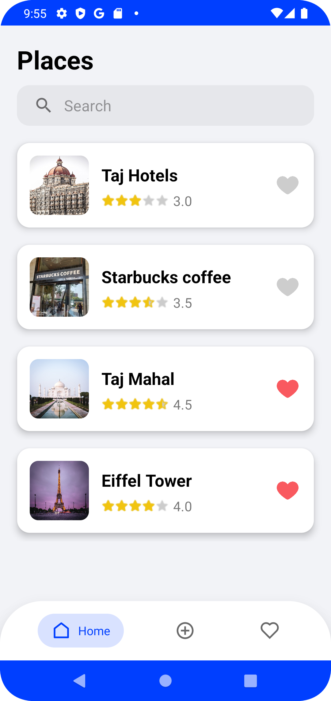

# HappyPlacesApp

[](https://android-arsenal.com/api?level=23#l23)
[](https://kotlinlang.org)
[](https://en.wikipedia.org/wiki/MIT_License)

Happy Places Android App built using Kotlin based on modern Android application tech-stacks helps you keep a track of various places as your likings and store it in a local database.

## Features
* Build with modern UI design and includes animations.
* Home fragment to view all the saved places.
  - Added Swipe to edit/delete callbacks on recyclerView.
  - Also added a like button to make a place favorite.
* Add fragment to add a new place with multiple details.
  - Use of **Place API** provided by Google to search/autocomplete a location.
  - Use of to **Play Services Location** track live and precise location.
* Favorite fragment to visit your favorite/liked places.
  - Plays a great animation using KenBurnsView on the view for visual appeal.
* A Place Detail page for the places to go through all the details.
  - Use of collapsing toolbar with an edit floating button.
  - Use of map fragment on detail page so that one can easily locate the location.
  - Also added intent actions for call dialer, URL open, and email.

## Screenshots 
    
  

  

## Tech Stack & Open-source libraries 
* Minimum SDK level 23.
* [Kotlin](https://kotlinlang.org/) - official programming language for Android development.
* [Coroutines](https://kotlinlang.org/docs/reference/coroutines-overview.html) - for asynchronous programming.
* [Place API](https://developers.google.com/maps/documentation/places/android-sdk/autocomplete) - The Places API is a service that returns information about places using HTTP requests. Places are defined within this API as establishments, geographic locations, or prominent points of interest.
* [Google Play services](https://developers.google.com/android/guides/overview) - library that helps to optimize on-device resources and track locations.
* [Android Architecture Components](https://developer.android.com/topic/libraries/architecture) - collection of libraries that help you design robust, testable, and maintainable apps.
  - [Data Binding](https://developer.android.com/topic/libraries/data-binding) - data objects to bind UI components in your layouts to data sources in your app.
  - [ViewModel](https://developer.android.com/topic/libraries/architecture/viewmodel) - stores UI-related data that isn't destroyed on UI changes. 
  - [Room](https://developer.android.com/topic/libraries/architecture/room) - access your app's SQLite database with in-app objects and compile-time checks.
  - [Lifecycle](https://developer.android.com/topic/libraries/architecture/lifecycle) - components to perform actions in response to a change in the lifecycle status of another component, such as activities and fragments.
* [Navigation](https://developer.android.com/guide/navigation) - interactions that allow users to navigate across, into, and back out from the different pieces of content within your app.
* [Fragment](https://developer.android.com/guide/components/fragments) - represents a behavior or a portion of user interface in a FragmentActivity.
* [RecyclerView](https://developer.android.com/guide/topics/ui/layout/recyclerview) - for display a scrolling list of elements based on large data sets.
* [Material-Components](https://github.com/material-components/material-components-android) - Material design components.
  - [Material Dialogs](https://github.com/afollestad/material-dialogs) - library with extensible dialogs API for Kotlin & Android.
* [Dexter](https://github.com/Karumi/Dexter) - Dexter is an Android library that simplifies the process of requesting permissions at runtime.
* [KenBurnsView](https://github.com/flavioarfaria/KenBurnsView) - Android library that provides an extension to ImageView that creates an immersive experience by animating its drawable.
* [Picasso](https://github.com/square/picasso) - A powerful image downloading and caching library for Android

## Contributing
Awesome! If you would like to contribute you're always welcome!

### Steps :
1. Fork it

2. Create your feature branch (git checkout -b my-new-feature)

3. Commit your changes (git commit -m 'Add some feature')

4. Push your branch (git push origin my-new-feature)

5. Create a new Pull Request    

# License
```xml
Copyright (c) 2022 Sahil Kumar

Permission is hereby granted, free of charge, to any person obtaining a copy
of this software and associated documentation files (the "Software"), to deal
in the Software without restriction, including without limitation the rights
to use, copy, modify, merge, publish, distribute, sublicense, and/or sell
copies of the Software, and to permit persons to whom the Software is
furnished to do so, subject to the following conditions:

The above copyright notice and this permission notice shall be included in all
copies or substantial portions of the Software.

THE SOFTWARE IS PROVIDED "AS IS", WITHOUT WARRANTY OF ANY KIND, EXPRESS OR
IMPLIED, INCLUDING BUT NOT LIMITED TO THE WARRANTIES OF MERCHANTABILITY,
FITNESS FOR A PARTICULAR PURPOSE AND NONINFRINGEMENT. IN NO EVENT SHALL THE
AUTHORS OR COPYRIGHT HOLDERS BE LIABLE FOR ANY CLAIM, DAMAGES OR OTHER
LIABILITY, WHETHER IN AN ACTION OF CONTRACT, TORT OR OTHERWISE, ARISING FROM,
OUT OF OR IN CONNECTION WITH THE SOFTWARE OR THE USE OR OTHER DEALINGS IN THE
SOFTWARE.
```
